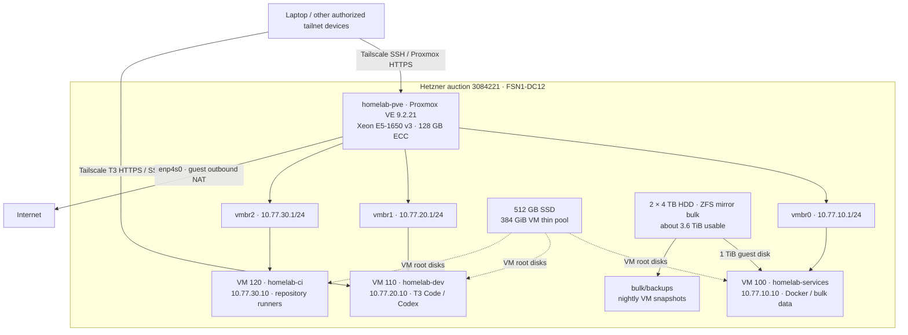

# Hetzner homelab topology

Verified live on **2026-10-02**, Europe/Berlin, from `laptop` via SSH,
Tailscale, and Proxmox CLI. The hypervisor and all three guests were reachable
and running. They share one physical server and its failure domain.



## Inventory and placement

| Host / VM | Role | CPU | RAM | Root / data storage | Record |
| --- | --- | --- | --- | --- | --- |
| homelab-pve | Hypervisor and storage | 6 cores / 12 threads | 128 GB ECC, about 125 GiB usable | 64 GiB root, 8 GiB swap, 1 GiB boot | [Host](machines/homelab-pve.md) |
| 100 / homelab-services | Docker services and bulk files | 2 vCPU | 16 GiB | 80 GiB SSD + 1 TiB HDD | [Services](machines/homelab-services.md) |
| 110 / homelab-dev | Remote development and AI tools | 4 vCPU | 32 GiB | 160 GiB SSD | [Development](machines/homelab-dev.md) |
| 120 / homelab-ci | Trusted project CI | 4 vCPU, CPU limit 3 | 32 GiB | 128 GiB SSD | [CI](machines/homelab-ci.md) |

The guest CPUs share the physical CPU; allocations are not dedicated cores.
Guests start automatically in services → development → CI order. These are
Debian 13 machines with no assigned compute GPU. Long development tasks belong
in remote tmux on `homelab-dev`, or in T3's existing background service.

## Management and networking

| Machine | Private guest network | Tailscale IPv4 | SSH access |
| --- | --- | --- | --- |
| homelab-pve | Bridge gateways `.1` above | 100.84.103.102 | `ssh homelab-pve`, root |
| homelab-services | 10.77.10.10/24 on vmbr0 | Not enrolled | `ssh homelab-services`, humunkulud through host |
| homelab-dev | 10.77.20.10/24 on vmbr1 | 100.108.73.48 | `ssh homelab-dev`, humunkulud through host; direct tailnet SSH also verified |
| homelab-ci | 10.77.30.10/24 on vmbr2 | Not enrolled | `ssh homelab-ci`, humunkulud through host |

SSH aliases are defined in the config repo's `ssh/homelab.conf`, included by
the laptop's SSH config. VM aliases currently use the host as ProxyJump.
Services and CI names are hostnames/SSH aliases, not Tailscale device names.

- Proxmox: https://homelab-pve.tail03caec.ts.net; user `root`, Linux PAM realm.
- T3 Code: https://homelab-dev.tail03caec.ts.net, proxied to guest loopback 3773.
- Host public uplink: `enp4s0`, IPv4 `136.243.39.57/26`, gateway `136.243.39.1`;
  IPv6 `2a01:4f8:212:717::2/64`.
- Guest bridges have no physical NIC attached. Guest IPv4 Internet traffic is
  masqueraded through the host; forwarded traffic to other private networks,
  the tailnet, and the host's public IPv4 is blocked.
- The host accepts management TCP 22/8006 through Tailscale. Public TCP
  22/8006 are blocked; Tailscale UDP 41641 and ICMP are allowed.
- Tailscale Serve endpoints are private to the tailnet. No Funnel endpoint is
  configured. CI has no development provider credentials.

Passwords, provider credentials, runner credentials, and pairing links remain
machine-local. Keep passwords in Bitwarden; never put values in fleet notes.

## Storage and recovery

- SSD: Intel 545s 512 GB, serial `BTLA75030D2Z512DGN`. Its high wear was
  explicitly accepted. It is a single unmirrored drive; monitor SMART.
- Proxmox storage `ssd`: 384 GiB LVM thin pool `pve/data`. Guest root disks
  total 368 GiB logical capacity, plus their small cloud-init volumes.
- HDDs: Seagate 4 TB, serials `Z4F03GAC` and `Z4F03FQV`, ZFS mirror `bulk`.
  Identify physical disks by serial/by-id; `/dev/sdX` assignments change.
- Proxmox storage `bulk`: ZFS `bulk/vmdata`. VM 100's 1 TiB disk has serial
  `homelab-bulk` and ext4 mounted at `/srv/homelab`.
- Proxmox storage `backups`: `/bulk/backups`, dataset `bulk/backups`; it shares
  remaining HDD capacity with bulk VM data. ZFS ARC is capped at 16 GiB.
- Backup job `nightly`: VMs 100/110/120 at 02:30 Europe/Berlin, snapshot mode,
  zstd compression, 3 daily and 2 weekly retained backups.
- A development VM backup was restored and booted in temporary isolated VM
  111; its guest agent verified an expected file. The test VM was removed.
- Offsite backup is not configured. The mirror and local snapshots do not
  provide another physical failure domain. Database dump/restore procedures
  remain to be added when applications are deployed.

Infrastructure scripts live in `~/Projects/homelab/proxmox` on the laptop.
Operational documentation lives in `~/Documents/homelab-docs/setup.md`.
The development VM has its own config checkout and installed agent kit;
Syncthing is installed there but not paired or running.

## Verify before changing anything

```bash
tailscale status
ssh homelab-pve 'pveversion; qm list; zpool status bulk; pvesm status'
ssh homelab-dev 'systemctl --user is-active t3code.service; ~/.local/bin/codex login status'
ssh homelab-services 'docker compose version; df -h /srv/homelab'
ssh homelab-ci 'systemctl list-units --type=service --state=running "actions.runner.*"'
```

Reachability, runner counts, and available space are dated observations.
Check them again before allocating workloads or changing storage/networking.
